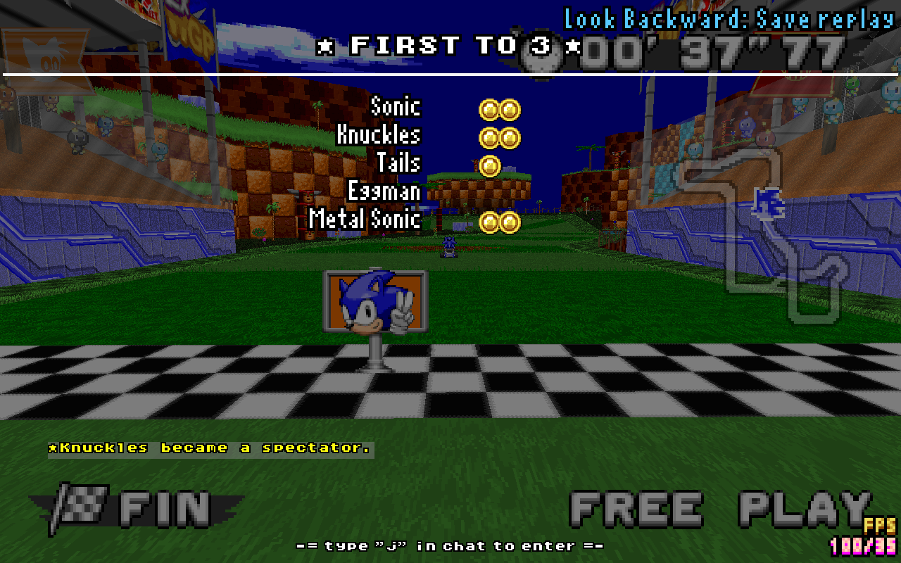
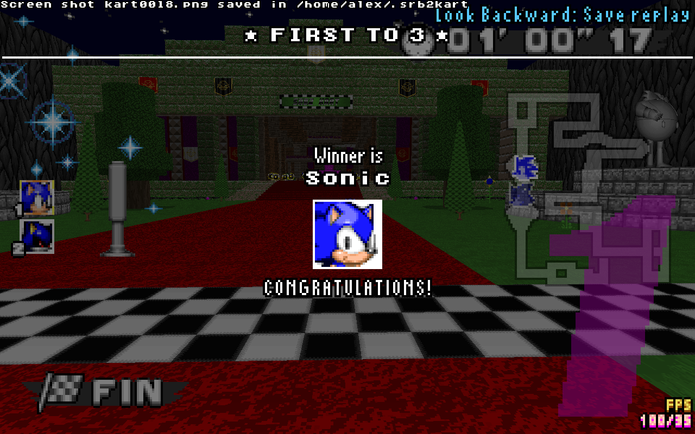

# "First To" mod for Sonic Robot Blast 2 Kart

## About

The "*First To mod*" is a lua script that adds an additional and optional mode for SRB2Kart races:
    the "**First to X**" mode!

Basically any player can start a *first to X* challenge for him and other players who feel like taking him on!

The player just has to write `first to N` (where N is a number) in the text chat (or `first_to N` in the console), to start a *first to N* round.
Players who'd like to take on this challenge can join the round by typing `j` in the text chat (or `ft_join` in the console).
The mod will count the wins and declare a winner at the end of the last race.

This script is **race mode only** and therefore **not compatible with battle mode** (no effect)… 

 

## Distribution & use

I allow to this work to be modified for anyone's personnal need or purpous.
However, I do not wish for said modifications to be publish without my informed consent.

In other words, you are free to use this on your server, you are free to modify it for you server
but I'd rather not have you sharing and distributing said modification without my consent.

Thank you.

## Commands & variables

This script provides the following variables:

- `ft_enabled` - default: `On` - If set to `Off`, *FirstTo* mod will not be active nor usable

- `ft_absolute_win` - default: `Yes` - By default only absolute wins count as an additional victory (i.e. finishing 1st, in front on the whole other racers), but if set to `No`, the winner of the round will be the player to finish first among the other contesters (i.e. players who joined the *First to X* round) only. Meaning the players doesn't have be in first place at the end of the race, but just needs to be the first among the contersters only to cross the line

- `ft_allow_ties` - default: `No` - If set to `Yes`, eventual ties on first place at the end of the race will count has  a victory for both contesters. This then opens the slim possibility of have multiple winners for the *First to X* round.

- `ft_admin_calls_only` - default: `No` - If set to `Yes`, only a playor with administrator privileges will be able to start a *First to X* round.

- `ft_player_join` - default: `No` - If set to `Yes`, players wont be able to join an ongoin "*First to X*" round by using the command `ft_join` no by typing `j` in text chat.

- `ft_show_results_exclusive` - default: `No` - If set to `Yes`, non-contesting players (i.e. players who didn't join the ongoin "*First to X*" round yet) won't be shown the advancement screen (results & victory screens) at the end of the race.

This script provides the following commands:

- `ft_first_to` - Takes an integer *X* as argument, and launches a new "*First to X*" round. *X* has to remain within a certain range though (see command `ft_round_minmax`) If a round was already ongoing the attempt will be aborted, unless the caller has admin privileges and will there for change the required victory number for said round (`ft_first_to 0` is equivalent to aborting ongoing round). - Calling this command from console is equivalent to typing `first to X` in text chat.

- `ft_cancel` - _Admin only_ - Shortcut, equivalent to `ft_first_to 0`

- `ft_join` - Call this command to join an ongoing "*First to X*" round, does nothing if none. - If the player calling this command as administrator privileges, he can pass another player's name has argument (e.g. `ft_join "Player 1"`) to make this player join the round. - Optimal use of this command is with a key bind within your `kartexec.cfg` to skip the text chat or console and join with a simple key press: `bind j "ft_join"`

- `ft_player_wins` - _Admin only_ - Takes 2 arguments: a player's name and a number, and sets the matching player with the given number of victories for the ongoing "*First to X*" round (e.g. `ft_player_wins "Player 1" 2`). If the players wasn't a contester, he will join the round with given number of victories. If caller passes `nil` or `none` instead of a number, the targeted player will no longer be part of the ongoing round.

- `ft_round_minmax` - _Admin only_ - Takes 2 numbers as arguments. Sets the range of needed wins in which any player can call a "*First to X* round. For example, if `ft_round_minmax 1 7` is called by admin, the players will only be allowed to use command `first_to N` ( or `first to N` in text chat ) with `1 ≤ N ≤ 7`.

## Compatibility

### Race mode only

As of now, "*First to X*" script, is race mode only. Due to the simple fact that I haven't really played SRB2Kart's battle mode, and have no real clue what it' about.

### Combiring and Elimination

"*First To*" mod *should* be compatible with the "*[Combiring](https://mb.srb2.org/showthread.php?t=44095)*" and "*[Elimination](https://mb.srb2.org/showthread.php?t=43888)*" modes. I have no clue regarding other game changing modes.

### The issue with splitscreen multiplayer...

Players can chose to join an ongoing *First to X* round. But this raises a problem regarding splitscreen multiplayer…

Appart from the main/first player, the other players don't have access to console or text chat and therefore to the `ft_join` command. The simple solution would be to make all the splitscreen party join the round when main player calls for join. However the problem arise when you consider splitscreen multiplayers clients in a netgame: as of SRB2 Kart v1.3, there is, to my knowledge, no native way for lua script to make other players and the server know which players joined the netgame within a local splitscreen party. And therefore no way to know that a "main" player speaks for others (the members of his local splitscreen party).

This is why, splitscreen isn't supported (meaning players other than the "party leader" can't join an ongoing "*First to X*" round)… by default.

#### PartyChecker workaround script

In light of this, I have written an experimental [workaround script](https://github.com/AlexPoilrouge/SRB2Kart_mod_and_misc/tree/master/scripts/PartyChecker).

This scrpit uses a not-so-clean trick to determine and let other clients and server know that certain clients are in a multiplayer splitscreen party together.

Therefore, if you want (a chance) to (maybe) have the "*First To*" mod work in a netgame as intended with potential splitscreen multiplayer clients, you need to load it alongside the `KL_PartyChecker_utils-X.x.lua` script.

